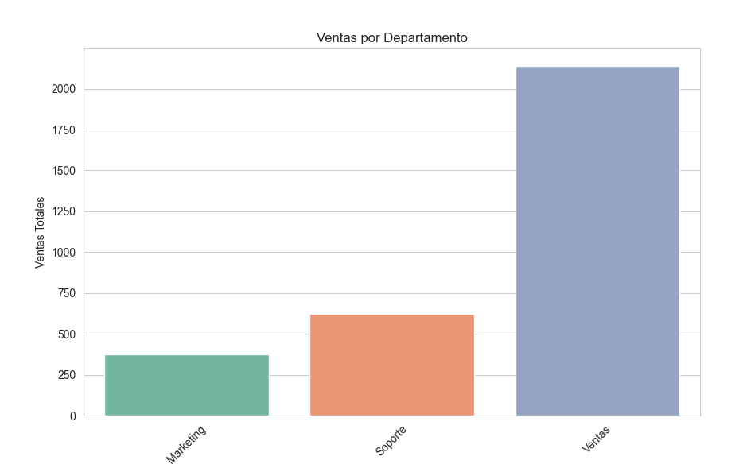

# 📊 Analizador de Rendimiento de Empleados (Python)

Este es mi primer proyecto profesional de Análisis de Datos, desarrollado de forma autónoma durante mis primeras semanas aprendiendo Python (Marzo 2026). El objetivo es automatizar la evaluación de desempeño de una plantilla de 60 empleados.

## 🚀 Funcionalidades
El sistema es una herramienta de consola (CLI) que permite:
* **Limpieza de Datos:** Normalización de nombres de columnas usando `pyjanitor`.
* **Cálculo de KPIs:** Generación automática de métricas de *Rendimiento* (Ventas/Salario) y *Eficiencia* (Ventas/Horas).
* **Segmentación:** Clasificación de empleados en categorías "Alto" y "Bajo" rendimiento basados en la mediana.
* **Visualización de Datos:** Generación de gráficos estadísticos (Barras, Conteo y Dispersión) con `Seaborn`.
* **Análisis Estadístico:** Reportes de promedios, Top 5 mejores y peores empleados, y ventas por departamento.

## 🛠️ Tecnologías Utilizadas
* **Lenguaje:** Python 3.12+
* **Librerías de Datos:** Pandas, NumPy
* **Visualización:** Matplotlib, Seaborn
* **Limpieza:** Pyjanitor

## 📂 Estructura del Proyecto
* `Analizador_Empleados.py`: Código fuente principal con la lógica del menú y procesos.
* `Analizador CSV.csv`: Dataset con la información de los 60 empleados generados para el análisis.
* `requirements.txt`: Lista de dependencias y versiones para replicar el entorno de desarrollo.

## 🔧 Instalación y Uso
1. Clonar el repositorio.
2. Crear un entorno virtual e instalar las dependencias:
   ```bash
   pip install -r requirements.txt
   ### 📈 Visualizaciones del Análisis

#### Distribución de la Plantilla

*Este gráfico permite identificar qué áreas tienen mayor carga de personal actualmente.*

#### Análisis de Productividad (Ventas vs Salario)

*Visualización de la eficiencia individual para identificar talentos de alto rendimiento.*
